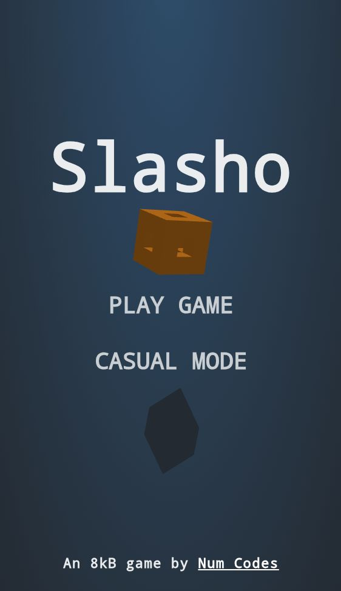

# 🎮 SLASHO

**Slasho** is a fast-paced slicing game inspired by Fruit Ninja — but with a twist! Instead of fruit, players slash through colorful, 3D-rendered cubes flying across the screen. Built with pure **HTML**, **CSS**, and **JavaScript**, this 8kB masterpiece delivers stunning visuals, real-time physics, and dynamic gameplay with zero dependencies.



---

## 🚀 Features

- ⚡ Fast-paced cube slicing mechanics
- 🎲 Randomized 3D cube spawns in multiple colors and difficulty levels
- 🌀 Slow-Mo power-ups for bonus strategy
- 🧠 Two Game Modes: **Ranked** & **Casual**
- 💾 High Score system (stored in localStorage)
- 📱 Fully responsive and mobile-ready
- 🎨 Stylish retro-futuristic UI with custom HUD
- 🕹️ Lightweight – no libraries, only core JS

---

## 📂 Project Structure

```

slasho/
├── index.html        # Main game interface
├── style.css         # Game visuals and UI styles
├── main.js           # All game logic, physics, rendering

````

---

## 📸 Preview

Open `index.html` in your browser or [Play it Online (optional)](https://slasho.vercel.app/)

---

## ✨ How to Play

- Move your mouse or finger across the screen to **slice** incoming cubes.
- Smash multiple cubes in succession to rack up your **score**.
- Avoid missing cubes — especially in Ranked Mode, or it's Game Over!
- Activate **Slow-Mo cubes** (blue wireframe) for extra slicing control.
- Hit **pink strong cubes** multiple times to destroy them.

---

## 🛠️ Installation

Clone the repo and open the `index.html` file in any modern browser:

```bash
git clone https://github.com/NumCodes/Slasho.git
cd slasho
open index.html
````

> No build tools or frameworks required.

---

## 👨‍💻 Author

Built with ❤️ by [Num Codes](https://github.com/numcodes)

---

## 📜 License

This project is open-source and available under the [MIT License](LICENSE).

---

## 🌟 Credits

* Game concept inspired by *Fruit Ninja*
* Cube visuals powered by a recursive Menger sponge effect
* Built in \~8KB of clean vanilla code

---
